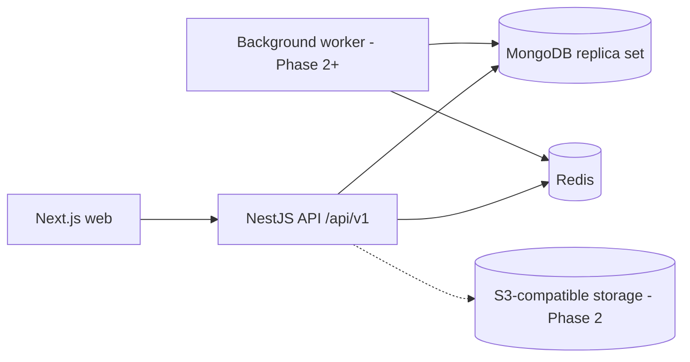

# Architecture (Phase 0)

```mermaid
flowchart LR
  Web[Next.js web] --> API[NestJS API /api/v1]
  API --> Mongo[(MongoDB replica set)]
  API --> Redis[(Redis)]
  Worker[Background worker - Phase 2+] --> Redis
  Worker --> Mongo
  API -.-> Obj[(S3-compatible storage - Phase 2)]
```

Object storage is deferred to Phase 2, when image uploads are built.
